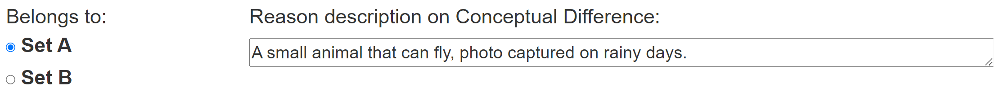

# Here Is A Simple Tutorial
## All you need to do as follows
+ Choose Set A or B to which the Query Image belongs.
+ Write the Reason description on Conceptual Difference.

**During the Qualification.** You need choose either of the description sentences of two sets of images, the sentences describe the difference between two sets containing different concepts.

As shown below:

> 
  
There have four similar test questions, you must choose all correct to qualify for exam questions. Then you can accept this work and get paid.

**During the HIT.** The only difference is that you need to write down the reason for your choice by looking at the pictures of sets A and B. Don't be nervous, there are many fairish answers. Your thinking process is what we care about. Use your imagination and aslo please take it seriously, we will review each of your answers.

As shown below:

> 

Please note that the current answer will be saved every time you press **Next**, please check your answer carefully before proceeding to the next, and finally remember to click **Submit** to get your reward.
