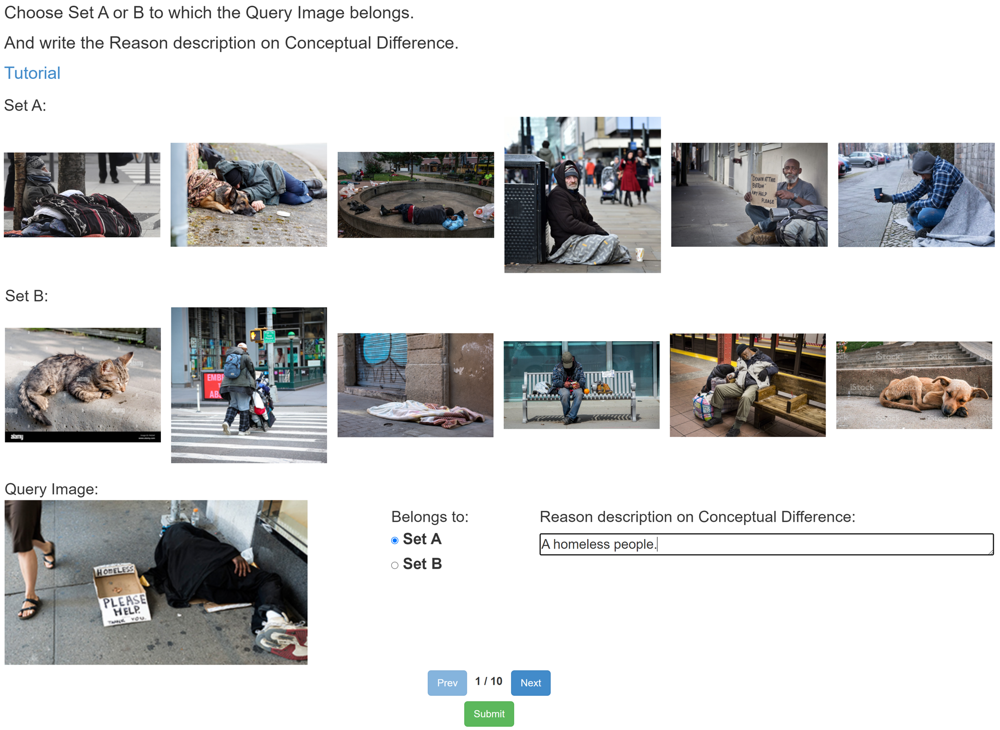
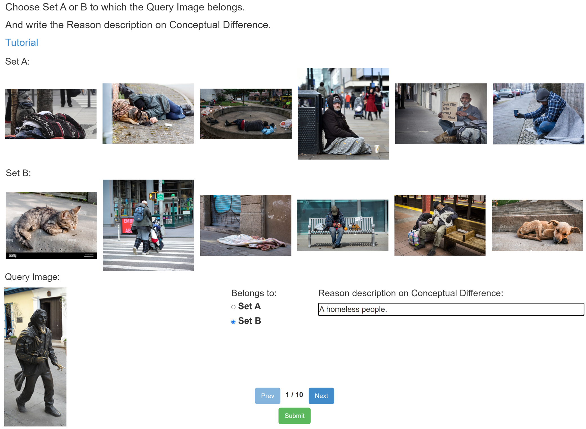
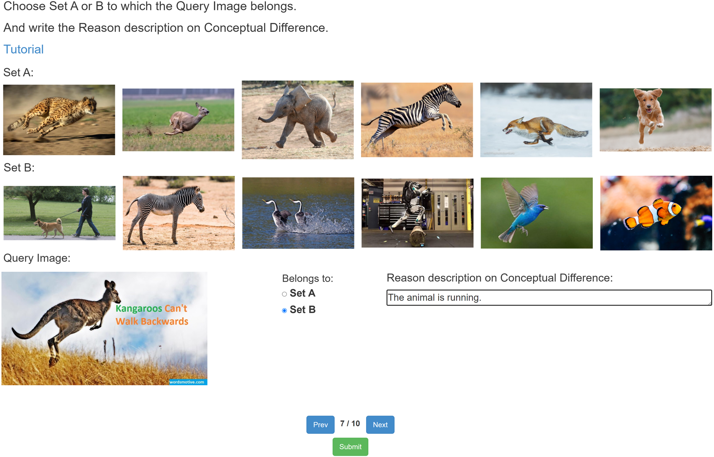

# Welcome to our task! Please follow the instructions below. Don't worry, we have all your questions covered.
## All you need to do as follows:
> 1.Take a look at two sets of images, Set A and Set B.

All the images in Set A can be described by the same sentence, let's denote that sentence as **C**.

However, sentence **C** is **not true** for **all** images in Set B. 

Therefore, even if you might have multiple sentence **C**s in mind after looking at those images in Set A, not all these candidates are the true sentence **C**. You need to refine your sentence **C** using images in Set B to ensure it satisfies the two requirements above.

The sentence **C** could be broken down into a few **"concepts"**, such as category (ex. dog, cat, etc.), color (ex. red, white, etc.), shape (ex. square, round, etc.), size (ex. small, big, etc.), material (ex. metal, glass, etc.), containment (ex. in a plate, on a table, etc.).

The concept could also be a bit complex, such as scent, taste, nutrition, fragile or not, functionality (ex. object that can fly, swim, etc.), affordance (ex. object that can be used to cut, object that can be used as a hook, etc).

> 2.Then determine whether a query image belongs to Set A or B.

This is easy! If the query image satisfies the sentence **C**, it should belong to Set A! Otherwise mark it as from Set B.

> 3.Finally, write down the sentence **C** in your mind.

If you're really not sure about your answer, just provide your best guess! Please make sure what you write down is a **sentence**, not a few words!!

> Ex. A small bird that is flying ✅ bird, fly ❌

Let's review some examples step by step:

> 
  
Look at the images in set A and see that the Highest Common Factor of the concepts they contain is 'A homeless people'.

So you should write down 'A homeless people.' into the sentence **C** text box and select set A.

> 

The images of set A and set B are the absolute same as above.

The Query Image is different, it looks a little like 'A homeless people', but it's a bronze statue, so you should select set B and also write down 'A homeless people.' into the sentence **C** text box.

> 

The images of set A are describing "The animal is running".

Human is also an animal.

> 

Kangaroos is also an animal, but we all know kangaroos can only "jump", so you should select set B.

> Please note that the current answer will be saved every time you press **Next**, please check your answer carefully before proceeding to the next, and finally remember to click **Submit** to get your reward. There are 10 HITs in total.

> The Qualification is a simplified version of HIT, because you only need to select one of the four Sentence **C**, instead of writing it yourself.
